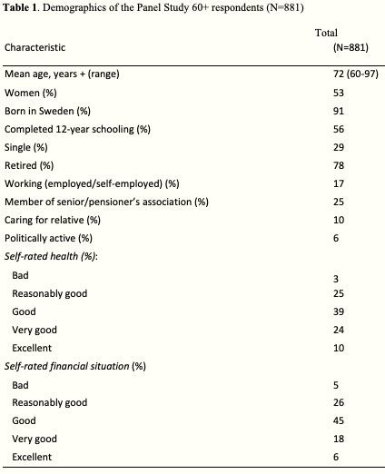
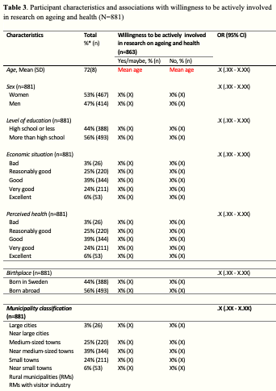
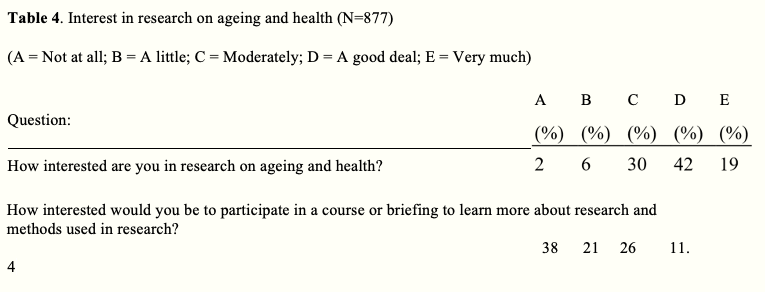
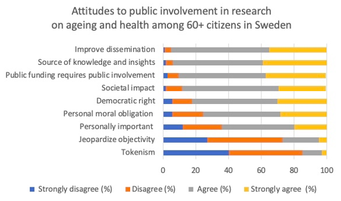
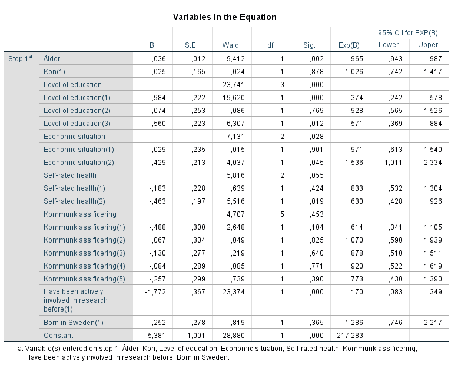

```{r setup, include=FALSE}
library(tufte)
# invalidate cache when the tufte version changes
knitr::opts_chunk$set(cache.extra = packageVersion('tufte'))
options(htmltools.dir.version = FALSE)
```

```{r, include=FALSE}
options(tinytex.verbose = TRUE)
```

---

<!--
SS and I had a meeting in which I presented the analyses I have done so far and he commented on it. [Here](/htmlfiles) are the notes from what we discussed and agreed on:

`r margin_note("Except for this feedback, I also need to take into account the comments I received on the manuscript by OJ and SI, but their comments I will go through next.")`
-->


# 1. Measures brought up in methods not sufficiently explained and motivated

* **PROBLEM**: The instruments and measures that are brought up in the methods section, must be more explicitly motivated. There are probably good reasons for including these instruments and measures in this particular study. However, the reasons given and how these instruments and measures connect to the research questions are not sufficiently explained at the moment.

* **ILLUSTRATION OF PROBLEM**: The suggested name, *Home municipality classification*, is not an easily understood name for the phenomenon we refer to; another term needs to be used. 

    And this is also a good example of a measure that I need to motivate better why it is important to include; What will these municipality classifications tell us? Also, should we really include all nine categories? It is quiet much considering that we are mainly interested in how the urban vs. rural influence on awareness, attitudes and willingness. 

    Furthermore: Is the distribution typical of Sweden? – A good reason to include such a measure would otherwise be as a means to understand better how representative the sample is of the general (60+) population. Even though that this is something that then would be brought up in the discussion rather than here, I should bear that in mind when bringing the measure up here. 

* **SOLUTION**: SS gave the advice to gather the measures that we designed under a heading called something like 'Study-specific questions'^[This also relates to what was mentioned in my last supervision by SI and which I know that she commented on in her written feedback on my manuscript]. This section should start out with a paragraph on how we developed our questionnaire with the particular questions used, then describe the ones that we are going to use in this paper.

# 2. Preferred kind of research involvement  - include but move to descriptive section 
As of the measure of the preferred kind of research involvement of respondents willing to be actively involved, it is currently introduced in the methods section in the following way:

  > In order to find out the preferred kind of research involvement of respondents willing to be actively involved, these participants were also asked to take a stand on the statement “If you were given the opportunity, how likely is it that you would like to participate by...” followed by six different examples of active involvement such as “being part of a user council, reference group, board or the like?” and an open answer option. Participants were here assigned five response options ranging from "Not at all" to "Very much".

  However, SS rightly pointed out that this measure does not - as of now - connect to any of the research question for the study. In dialogue with SI, we agreed though that this measure is still highly relevant for the focus of the study BUT it should be moved to the descriptive section rather then put here.
  
# 3. Motivations and obstacles - exclude from study
It was decided (in dialogue with SI as well who dropped in to listen to discussion towards the end) that in this study we will not include 'Motivations and obstacles related to public involvement in research'. Rather, it will have to be the subject of another study.

# 4. Move description of categorization of open-ended questions
The description of how we (OJ, MK & I) went about categorizing the open-ended questions should be moved from the 'Data Analysis' section to the place where the study questionnaire is described.

```{marginfigure} 
*Table 1*

```` 

# 5. Awareness - needs further analysis
So far, I have only presented how many people were aware of the possibility to be actively involved in research. However, that is not enough in terms of analysis. SS pointed out that an outspoken goal for UserAge is to change peoples’ awareness (but not specifically to change their attitudes). In order to be able to do that, it is not sufficient to just know this, but I also need to investigate and analyze how awareness relates to demographics, self-rated health and economic situation, etc. We decided that rather than presenting these results in an independent table, I could preferably integrate it into the current *Table 1* by adding a few columns to it, as described here below.

```{marginfigure} 
*Table 3*

```` 

# 6. Table 1

## a) Give *Table 1* a more adequate title and look over its content
In the 'Results' section, *Table 1* is referred to as illustrating the "demographics" of the study population. However, in the table 'Self-rated health' is included which is not considered part of the 'demographics'. Thus, the heading of the table needs to be changed. 


```{marginfigure} 
*Table 4*

```` 

Also, *Table 1* as of now contains stuff that are not relevant to the paper. Either these variables need to be added to the method if they are motivated to include, otherwise they need to be deleted from the table.

## b) Add column for awareness

We agreed that I should add a column for awareness (Yes/No) so that it gets a similar look as *Table 3*. In terms of further analyses needed for this variable, I need to add a chi square test on differences.  This means I also have to read about how to avoid type II errors. Anyways, I need to test this in some way and add those values (OR?) in the table and maybe an asterisk indicating that it is significant. Also, in all table of this kind I need to include both frequencies and the *n* number.

```{marginfigure} 
*Figure 1*

```` 

# 7. Add *n* after % in running text
Not just in the tables but also in running text, after a percentage is given I should also provide the reader with the *n* number.

# 8. Interest - no table needed

Here we agreed that it is not necessary with a table which only contains two rows, so in other words I should delete *Table 4*.

# 9. Attitudes - sufficient level of analysis

As for attitudes, due partly to the complexity of the question, we (SS, SI and I) agreed that the current *Figure 1* represent a sufficient level of analysis for this variable.

# 10. Assure 'other' involvement is active involvement
When it comes to the variable 'Active involvement', I explained that I - due to the way that question was formulated - had felt forced to create a new variable simply indicating whether the participants had been actively involved or not. I created that new variable based on a logical expression^[If 13.1 $\vee$ 13.2 $\vee$ 13.3 $\vee$ 13.4 $\vee$ 13.5 $\vee$ 13.6 $\vee$ 13.7 = 'Yes' $\rightarrow$ *ActiveInvolvement* = 1].  SS asked whether I had controlled that the 'other' option^[The 'other' option corresponds to 13.7 and was formulated: "*In anoher way, namely...*"] that the participants could fill in here indicating other kind of active inolvement really corresponded to *active* involvement. I said that this was one of the things that OJ, MK and I had sorted out, but as I said it I  realized that we had actually created a new subcategory within this group for involvement that was not active. So, I will have to go through that again and see if I have done things correctly.

# 11. Check correlation between predictors differently
SI and SS did not recognize the method I had used for checking correlation between the independent variables. According to them there is a common way of doing this which I will have to read up on and do.

# 12. Use *ActiveInvolvement* as a confounder in the logistic regression
Furthermore, I was asked to use *ActiveInvolvement* as a confounder rather than the way that I had used it when setting up my (first) attempt* of a logistic regression for this study. 

```{marginfigure} 
*Here are the results of that attempt:

```` 

# 13. Include a step-wise bivariate analysis
A bivariate analysis was lacking and such an analysis was considered important; especially since the study was not so theoretically driven. In an explanatory analysis such as was expected her it could be good, argued SI and SS. Thus it was decided that I should perform a bivariate analysis for each of the predictive variables towards the dependent variable.

# 14. Consulting with a statistical expert
SI suggested that once I get a better grip of the material, we set upp a meeting with SU - a statistical expert. She can help has with the validity. It was decided that I will book an online meeting (1-1.5 hrs) with her together with SS and SI. She needs about two weeks notice in advance. 

# 15. Literature tips
In order to better understand what kind of analyses were needed and why certain measures and not others were appropriate, I was recommended to read up on collinearity analysis and bivariate analysis. One book that SS recommended was *Using Multivariate Statistics* by Tabachnik & Fidell.
