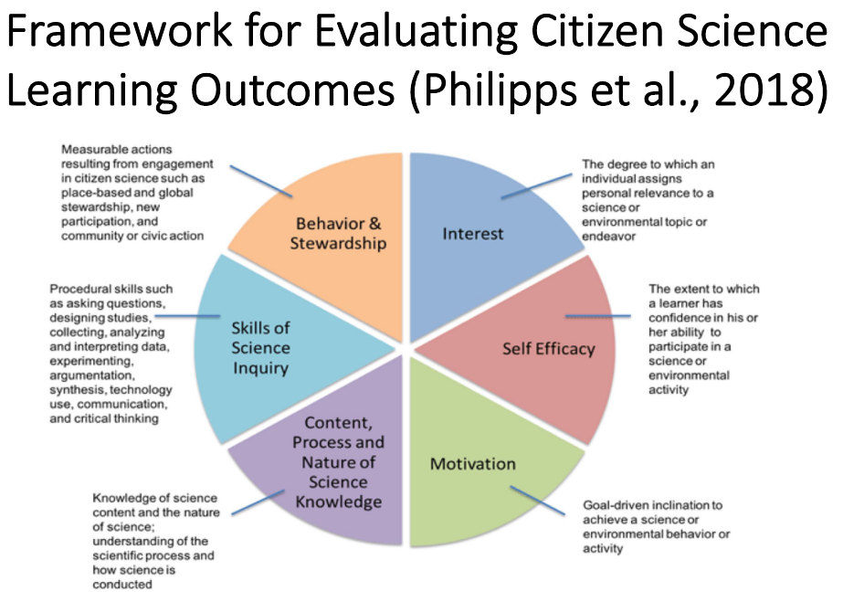

```{r setup, include=FALSE}
library(tufte)
# invalidate cache when the tufte version changes
knitr::opts_chunk$set(cache.extra = packageVersion('tufte'))
options(htmltools.dir.version = FALSE)
```

```{r, include=FALSE}
options(tinytex.verbose = TRUE)
```

---


# Förtydligade om dokumenthantering och arbetsordning 
Tills mötet hade jag laddat upp tre olika dokument till Google Docs^[Det handlade om: <br> [Ansökan: Allmän information och underskrifter](https://docs.google.com/document/d/1pWNFZsRyFbtK4zD3nIcnRd2j1APo_HpvdR8rq7b1ytk/edit); <br>
[Ansökan; Beskrivning av forskningsprojektet](https://docs.google.com/document/d/1bJ1BzZsn7nnje_qoxxrQ315yDgcV8kCy2xAmjGbdXbM/edit#) <br> och om det så kallade [A4-dokumentet](https://docs.google.com/document/d/1bJ1BzZsn7nnje_qoxxrQ315yDgcV8kCy2xAmjGbdXbM/edit#).]. Jag beskrev att jag var lite konfunderad kring om alla dessa dokument skulle fyllas i och i så fall i vilken ordning. Vad vi kom fram till under mötet var att vi använder det så kallade [A4-dokumentet](https://docs.google.com/document/d/1aqVR1XtiU_PSQ0YtKGLC0baZRdVJgScOXvpkITjgnWo/edit#heading=h.mbjsiz6n6jlo) som ett arbetsredskap^[A4-dokumentet motsvarar Bilaga 3 i tabellen som finns i slutet av [Ansökan: Allmän information och underskrifter](https://docs.google.com/document/d/1pWNFZsRyFbtK4zD3nIcnRd2j1APo_HpvdR8rq7b1ytk/edit) och ska vara ca fem sidor.] och sen i takt med att saker klarnar så fyller jag i de övriga dokumenten samt beaktar OJ:s och MG:s kommenterar. De använder då spårändringsfunktionen i Google Docs^[[Här](https://www.youtube.com/watch?v=AfaKRuDI13c) finns en video som förklarar hur den fungerar.] så att jag kan se vad de har ändrat medan jag skriver som vanligt.

# Förtydligande om kontexten för projektet
MG tog sedan upp att det för projektet [Sustain@Home](https://archive.fo/wNdio), som ju Bostadsförsöket tillsammans med tre andra delprojekt utgör en del av finns [en färdigformulerad projektplan](/pdfs/210226-sustain-at-home-projektplan.pdf)), som jag i formulerandet av etikansökan kan referera till med sidhänvisningar. På så sätt behöver jag inte fördjupa mig alltför mycket i den kontext som projektet ingår i. Därtill finns ett påbörjat arbetsmaterial som beskriver Bostadsförsöket [här](https://lu.app.box.com/file/780833694117). 

# Vägen framåt
Det är viktigt att betona, menade MG, att denna etikansökan enbart omfattar vår delstudie och ingen annan och att jag bör ha det i åtanke när jag formulerar den så att den inte blir för yvig. Vi beslutade att jag till nästa fredag fortsätter skriva på det så kallade A4-dokumentet. Att jag anstränger mig för att försöka hitta en bra titel på studien^[Den går tills vidare under arbetsnamnet *Utvärderingsstudien*.]. Jag behöver också utveckla tankarna om lärande. Jag framförde att jag tycker att det är svårt att prata om lärande eftersom lätt blir vagt vad man egentligen åsyftar. MG höll med och menar att man måste bryta ner det och prata om fakta och andra taxonomier, använda de begreppen i stället. Det är så lärare gör med sina elevers lärande. Jag förklarade vidare att jag upptäckt ett till synes intressant teoretiskt ramverk om olika sätt att utvärdera lärandet inom citizen science^[En illustration av ramverket finns på nästa sida.] på sidan 50 i [följande presentationsmaterial](https://www.cswinterschool.uzh.ch/dam/jcr:54275d96-0aa3-4215-8c57-6ee5c83a7262/Slides%20CS%20und%20TL_Foerster_2020_14_1%20.pdf/) som MG tidigare tipsat om.
<br><br>

<!--`r margin_note("Så här såg ramverket ut.")`-->


<br>
När det kom till lärande nämndes också möjligheten att ge deltagarna en särskild 'task'-lista, alltså ett antal uppgifter att utföra (utöver den gängse bedömningen av den egna bostaden) och därigenom studera deras lärande. Men detta var bara en tanke som presenterades. Vi beslutade därefter att vi vid nästa möte också behöver prata om en tidsplan för arbetet framöver som återstår.. Jag ombads också att när det gäller frågan om att ta med kvalitativa intervjuer i studien, fundera över det till nästa gång. 

# OJ:s kommentarer
OJ hade skrivit ner sina - i sitt tycke - ostrukturerade tankar baserade på genomläsning av utvärderingar av medborgarforskning och ansökan om projektet Sustain\@Home och det dokumentet finns att tillgå [här](/pdfs/210226-OJs-tankar-om-massexperimentet.pdf). Om man ska försöka beskriva de mest centrala av hans kommentarer^[Hans dokument är ganska långt och korthugget skrivet så därför kan det vara på sin plats med en kortare sammanfattning.] så handlade de om att till medforskarna ställa frågan "Upplever du att tillgängligheten i din bostad är bättre eller sämre än genomsnittet?" före och efter deras deltagande. Följdfrågan, föreslog OJ, skulle kunna vara: "Vad är det som gör tillgängligheten i din bostad bättre eller sämre?". Vidare kunde frågan "Upplever du att att du kan göra något för att förbättra tillgängligheten i din bostad?" ställas för att undersöga hur de såg på sina möjligheter att påverka sin situation. Och om frågan var jakande kunde denna följdfråga ställas: "Vilken typ av åtgärd?". Sedan funderade OJ också på vad det är för kapacitet vi egentligen pratar om och ställde sig frågande till om det är möjligt att bara avgränsa kapacitet till individen. Kapacitet är ju också, menade OJ, förmågan att bidra till vetenskap och påverka det vidare samhället och det är utifrån det som man pratar om *active* citizenship. "Supporting participation and active citizenship", utgjorde enligt OJ ett av huvudsyftena med Sustain\@Home. Jag undrade lite över skillnaden mellan *summativt* och *formativt* lärande. OJ förklarade att ett prov är en summativ mått på kunskap, men när läraren interagerar med eleverna så är det en formativ process. Han menade att om det blir något med supportgruppen skulle man således kunna göra något där kopplat till det formativa lärandet.

Därefter tog OJ upp vad som stod beskrivet i ansökan med avseende på vad som skulle erbjudas deltagarna. I ansökan står att en 1.5 dag-kurs ska erbjudas instruktörer för att de ska lära sig hantera appen och hemsidan och lära ut den till andra. Det står också omnämnt att det ska finnas en manual och en instruktionsvideo. OJ och jag pratade^[Vid denna tidpunkt var den planerade mötestiden slut och MG hade lämnat mötet, därav att hon inte omnämns.] om att det kunde dels handla om en instruktionsvideo för användandet av själva tekniken, men också därtill att Susanne i motiverande ordalag pratade om varför ett deltagande i denna studie var viktigt. När OJ, som testat att utföra ett antal tillgänglighetsbedömningar med appen för egen del, visade mig hur man gick tillväga för att studera resultatet av sin egen och andras bedömningar från hemsidan. Jag uppfattade det som en besvikelse; det till synes enda om i nuläget gick att få fram var svartvita tabeller i pdf-format. Jag uttrycke min oro över att detta riskerade att inte locka så många till att genomföra bedömningarna, eftersom det resultat som man fick fram vår så trist och otillgängligt utformat. Varken OJ eller jag ansåg oss dock manade att dra i detta eftersom det inte riktigt låg på vårt bord utan vi såg det snarare som MB:s ansvar. Dock beslutade vi oss för att nämna detta för MG vid nästa mötestillfälle och se vad hon ansåg möjligt och lämpligt att göra .
