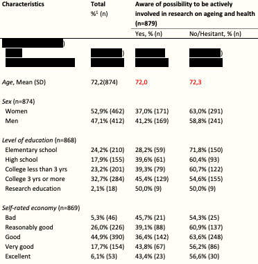
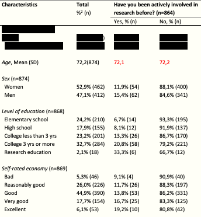
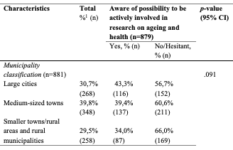

```{r, include=FALSE}
options(tinytex.verbose = TRUE)
```
---

```{r setup, include=FALSE}
library(tufte)
# invalidate cache when the tufte version changes
knitr::opts_chunk$set(cache.extra = packageVersion('tufte'))
options(htmltools.dir.version = FALSE)
```


# 1. Study II


## Nationality - a missing variable?
RL, OJ and SI provided JF with their feedback on the latest version of the manuscript. RL wondered where nationality was to be found in the analysis, since according to him this was an aspect mentioned in the literature as being related to willingness to be involved in research. I explained that there were two reasons for me not including it at this stage. The first reason was that nationality or ethnicity was not explicitely included in the research question. The second reason that I found the question too broad a question to gain some knowledge from, since it was simply a matter of where a person was born. It was anyway decided that I should include it and make it part of demographics.


## Include age categories? 
I was told that for the presentation of age in the results, I need to add standard deviation in Table 2 and 3. 
```{marginfigure}
Excerpt from **Table 2**.

```
OJ was missing age categories and RL as well wondered about comparing age groups since it was often done in other studies from CASE. If a division into age groups were to be included, SI argued, it would simply about descriptives then. It was suggested that I, to start with, in Table 2 and 3, could add the following age groups in order to provide the reader with a bit more information: 60-69; 70-79; 80-89: 90+.
```{marginfigure}
Excerpt from **Table 3**.

```

## Clearer description of how regression follow on uni- & bivariate analyses

It was pointed out by the supervisors that one of the biggest shortcomings with the manuscript in its current form was that it did not contain enough information about how the analysis of the data went and how it was justified. Typically, SI explained, when you do the bi-variate you do a cut-off and decide what to include and not in further analyses. This needs to be done here as well, and overall it not sufficiently clear for the reader how and why I went from one analysis to the next. 

## Dig more into the health status variable
One thing that is not sufficiently explored in the analysis and in the discussion is how health relates to willingness, and how the results relate to previous research. It appears in the results that there seems to be a negative correlation between self-rated health and willingness, but what does that mean? Furthermore, the current manuscript suggests that the result indicates a conflict with previous research, but in that case this is something that needs to be developed further. It was stated during the supervision that the instrument *self-rated health* is not straightforward because it is precisely a subjective self-assessment measure, but that it seems to be the health measure that is available. However, OJ pointed out that we in the survey also included a frailty scale based on three or four questions. It was decided that I should add and analyze frailty as well. There might be a correlation between frailty and self-rated health and then I will just move a long with the one with strongest correlation.

## Municipality of residence - no significance, no mentioning
```{marginfigure}
The non-significant correlation in awareness in relation to municipal classification.

```
I pointed out that the results indicated 10% higher awareness of the possibility to be actively involved in research among people living in large cities compared to people living in rural municipalities, even though the p-value was not sufficiently low to indicate any significant difference. However, SI asked me not to speak of any correlation in the results if it was not significant.


# 2. Study III
I gave an update on study III and summarized what had been done so far in terms of formulating a research plan and an application for an ethical approval. SI pointed out that rather than speaking of older people's *capacity* as was done in the original project for Bostadsförsöket [The Housing Experiment]^[The project that constitutes the context in which data for study III will be collected.], it would have been more appropriate to speak of their *capability*. RL found that the study as it was formulated seemed to miss out somewhat on what older people brought to the project in terms of their knowledge and experience; that they had got experiential knowledge that we wanted also to gain from and not just the other way around. He expressed that what older people can bring to the table is narratives, their stories. Moreover, he suggested that one way of gaining access to these stories would be to have 5-10 older people account for them and that  maybe the opportunity provided by the Facebook supporter group could be one way of doing that. However, SI pointed out that what characterized a mass experiment compared to Citizen Science in general was that they were more about the opportunities of gaining access to large data-sets and not as much about mutual learning processes. I explained that I found RL:s idea of including narratives from older people in the study appealing, but that it was also a matter of priorities and what was manageable to include within the frames of a single study. It was decided that I should discuss and develop the overarching purpose with MG^[Researcher at CASE who has the operational responsibility for 'Bostadsförsöket' from a scientific point of view.] and MB ^[Active at the association Vetenskap & Allmänhet [Science & Public] and the person who has the overall responsibility for arranging the mass experiment as an event.] with these ideas brought up in the supervision in mind.


# 3. Study IV
In a discussion with SI about my precarious situation with regard to the time I had at my disposal and the work that remained, she had suggested including the article I co-authored at my previous university, Blekinge Institute of Technology (BTH), in the dissertation instead of the planned study IV. I presented this proposal to RL and OJ. SI maintained that she saw this as the only opportunity for me to be able to finish on time. Both OJ and RL saw potential in this approach in addition to the pure time and resource savings, e.g. in that this article could enable a discussion on how health technologies could potentially facilitate involvement. I promised to send the paper to RL and OJ. 

SI will next check with my former main supervisor at BTH if he agrees that this article is included in my dissertation. Before the summer, SI explained, we must also meet the head of department EA and have a dialogue with her that the conditions have been updated.

# 4. Next supervision
What remains to be done is to push the data analysis further and to describe it more explicitly in the method section, as well as revise the introduction and discussion. The next supervision was set for **Tuesday 30 March at 10.30 - 12.00** and will be held via Zoom on [\textcolor{blue}{\uline{this link}}](https://lu-se.zoom.us/j/65572600320). I will mail the manuscript to the OJ, SI and RL a week before that, i.e. on Tuesday 23 March. 

