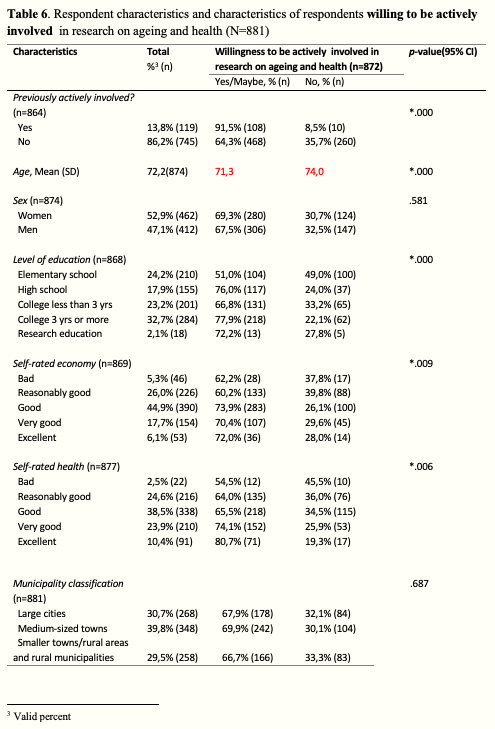
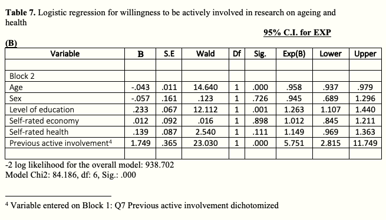

```{r, include=FALSE}
options(tinytex.verbose = TRUE)
```
---

```{r setup, include=FALSE}
library(tufte)
# invalidate cache when the tufte version changes
knitr::opts_chunk$set(cache.extra = packageVersion('tufte'))
options(htmltools.dir.version = FALSE)
```


## Table 6

```{marginfigure}

```

* Use OR instead of p-value in the willingness table; SS would have done a series of bivariate (univariable) logistic regressions instead of Chi square tests. But use Chi square for *awareness* and *previous active involvement*.
* Here we decide for a cut-of value of .1 or .2 - - . If you would include a p-value you would say that anything with a p-value higher than that it will not be included.. You can also still include it (even if you have a strong theoretical ground for it) and the standard procedure is to include sex even if it is not significant simply because that is the standard procedure.
* Age: SS did not support including age categories if there is no theoretical motivation for it. It will be an arbitrary cut-off, he argued. What is the difference between a 69 year old and a 70 year old. This needs to be motivated in that case.
* Sex: There have been studies showing that in in a traditional studies women have been more willing to participate, but do not know if that is for the older persons. Leave it in even if it not significance. 
* Level of education: Motivation for a multivariable analysis: Where is the significance to be found (between which categories? We do not know what is causing the difference. If you only have two levels then it is probably sufficient with a Chi square test. If you did 7 tests, 5% will be .05/7  - where 7 is the number of variables.  What happens if you put them in a mulitivariable is that we can explore for example how sex and education related to each other. 
* Self-rated health: SS supported to bring in frailty here… you could argue that both initially were considered relevant to include…
* As for the independent variable correlation, I need to do a “correlation matrix”.


## Table 7

```{marginfigure}

```

* Enter those (age, sex, level of education, self-rated economy) in block 1
* Enter 'Previous active involvement as block 2
* "Model Chi2: 84.186, df: 6, Sig.: .000" - this approves the model


