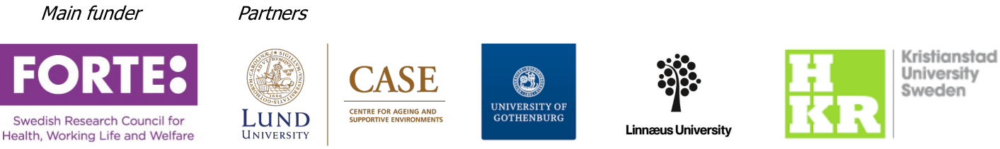

class: inverse, left, middle, title-slide

# Half-time review
## for my doctoral studies 
### Joakim Frögren
### Department of Health Sciences, Lund University
### 2020-08-27

???

Thank you Susanne, Hello everyone and thank you for attending my half-time review. 

I will start out by giving you a short description of my Phd project, its overarching aim and the research program it is a part of. then I will move on to give you some theoretical background, leading up to what I see as the knowledge gaps... and finally. I will present the four individual studies and end by linking them back to the overarching aim.

So, the title of my phd project is... 

---

My PhD project:
# Involving citizens and professionals in research on ageing and health

**Overarching aim**:
* The overarching aim is to increase the understanding of the involvement of
professionals and citizens in research on ageing and health; 

  + how such efforts are perceived;
  + how professional know-how and citizens’ ways of knowing could contribute to the knowledge development in research on ageing and health. 

* An additional overarching ambition is to gain insights of the potential and pitfalls of various participatory approaches and thereby contribute to the methodological development in the field.

???

"Involving citizens and professionals in research on ageing and health"

The overarching aim is to increase the understanding of the involvement of professionals and citizens in research on ageing and health:
- how such efforts are perceived and
- how professional know-how and citizens’ ways of knowing could contribute to the knowledge development in research on ageing and health.

An additional overarching ambition is to gain insights of the potential and pitfalls of various participatory approaches and thereby contribute to the methodological development in the field.

---

class: userage-slide

# UserAge research program

### - Six-year program (2016-2022)
### - Four Universities 
### - User representatives + international scientific experts
### - Four PhD projects
### - Focus: User involvement in research

???

The phd project is not an isolated project but belongs to a research program called UserAge which is a six-year program entaila four universities, and also user representatives in form of for example representatives of senior citizens, and also a group of international scientific experts.

My PhD project is not the only one but there are three other PhD students doing projects within the frames of the research program, each of us belonging to one of the universities involved.

The focus of the research program is different kinds of user involvement in research. 

---

# Illustration of the UserAge set-up 

???

Next, please don't be afraid my this figure, I know it is a bit much information to take in at once, but this is an illustration of the userage setup in terms of what we aim to do and who will do what. I will not explain it in detail because it woud take me more than 15 minutes. I just want to say that my PhD project, which you see there marked by a red line, is part of one of the modules. In the discussion after my presentation we could maybe come back to this figure.

---

class: inverse, center, middle, navy-slide

# What does to *involve* someone in research mean? 

???

Now, when it comes to the theoretical background i would like to start out by clearing out one of the words that i will be using most frequently today namely **involve**. What does to **involve** someone in research mean?

---

# To *involve* someone in research means:

???

Well, to involve someone in research as we define it within the research program means that the participant is an active partner in the process, not just a study object.

Byt slide!

However, this is not an either/or matter that either you are involved or you are a study object but rather a gradual scale, meaning there are many different levels at which you in the role of being a citizen or belonging to a certain profession can be involved in research.

--

.pull-left[

### That the participant is an active partner in the process, not just a study object1.

]
<!--

Photo: Erik Skogh

-->

[1] Fudge, N., et al. (2007). <a href=http://dx.doi.org/10.1093/ageing/afm029>Involving older people in health research</a>. <i>Age and Ageing</i>, 36(5), p. 492-500.

--

.pull-right[

### However, not either/or matter but  rather a <a class="grey-fade"> gradual scale</a>.

]

---

# Arnstein's *Ladder of participation*1 influential

[1] Fig. from Arnstein, S. R. (1969). <a href=http://doi.org/10.1080/01944366908977225>A ladder of citizen participation</a>. <i>Journal of the American Institute of Planners</i>, 35(4), p. 217-224.

???

When speaking of different grades of being involved, Sherry Arnstein's 'Ladder of participation' is important to mention. 

The article from where the idea of the ladder was published in 1969 and she wanted here to address and shed light of different levels of public participation in government decision making... so this is not about research involvement....her ladder is reaching from manipulation in the bottom marked here with a red line where a citizen might think she is involved but is in fact manipulated by the ones in and then it goes stepwise up to 'citizen power' on top where the citizens are in power.

Even though this ladder was not about public involvement in research it has been very influential in research, to try to describe different levels that the public can be involved in research. 

---

# Bammer's spectrum1 one recent example

[1] Fig. from Bammer, G. (2019). <a href=http://doi.org/10.1332/174426419X15532579188099>Key issues in co-creation with stakeholders when research problems are complex</a>. <i>Evidence & Policy</i>, 15(3), p. 423–435. 

???

Here is one recent example from 2019 by Gabriele Bammer and others researchers. I don't wan't you to read everything in it i just want you to notice that it goes from informing to the left where the researchers provide stakeholders with information to empower where researchers assist stakeholder in conducting their own research. 

All this to say that when we are speaking of involving people in research, and the aim is that they should take on a different role than a study object, it can in fact refer to many different levels of engagement.

That is an explanation of what we mean by 'involving' but...

---

class: inverse, center, middle, navy-slide

# Why involve citizens and professionals in research?

???

...why should one involve citizens and proffessionals in research. Isn't it just time-consuming and make research mor inefficient?

---

[1] Hronszky, I. (2005). <i>Parallelities in participatory approaches in production and public administration</i>. In H. Rohracher (Eds.)<a href=https://www.researchgate.net/profile/Harald_Rohracher/publication/292734131_From_passive_consumers_to_active_participants_The_diverse_roles_of_users_in_innovation_processes/links/5c6ec6e492851c168fcc7265/From-passive-consumers-to-active-participants-The-diverse-roles-of-users-in-innovation-processes.pdf> User Involvement in Innovation Processes</a>. Profil.

# Due to the intertwined quest to1:

.pull-left[
### I. Enhance Democracy
]

.pull-right[ 
### II. Adequately manage complexity and uncertainty 
]

???

Well, according to the sociologist Imre Hronsky, the idea of public involvement in research but also in society as a whole is rooted i two intertwined quests: the quest to enhance democracy and the quest to adequately manage complexity and uncertainty. 

I would like to just illustrate what he means by a quote from his writing, in which he develop this idea, where he says that:

Byt slide!

> "In a pluralistic society it is not possible to take into account just one 'natural' or 'objective' way of unifying the process of accounting for the issues. The enframing needed [...] always remains subjective and will be a result of discourse, negotiation1."

Byt slide!

Furthermore he states that what the citizens or professionals can add to for example a research process, is that they can express social values for the enframing, they can make a choice of perspectives and adress values for deciding in uncertain situations. 

My understanding, to put it briefly is that what a citizen or professional bring to the table in a research process is that they through their knowledge, experience and not least values help can help narrowing down what is really at stake and. And in this way they make the item that is being produced, whether it is knowledge or a product or service, more robust, better prepared to sustain. And by doing so they are also being acknowledged, empowered, for who they are and what they are, they get listened to - which relates then to democracy.

Ok, so this is the idea, but...

--

> "*In a pluralistic society it is not possible to take into account just one 'natural' or 'objective' way of unifying the process of accounting for the issues. The enframing needed [...] always remains subjective and will be a result of discourse, negotiation1*."

--

#### Citizens and professionals thus can:
- Express social values relevant for the enframing
- Help make a choice of perspectives 
- Express values for deciding in uncertain situations

---

class: inverse, center, middle, navy-slide

# Does it work? 

???

...does it work, does the involvement of citizens in research lead to empowerment, to improved democracy and to a better handling of complexity and uncertainty? 

---

# Some studies indicate:

* Better methodological and ethical quality1
* Increased relevance and impact1
* Effective dissemination of findings1 
* Improved health outcomes1

[1] Gradinger, F., et al. (2015). <a href=https://doi.org/10.1111/hex.12158>Values associated with public involvement in health and social care research: A narrative review</a>. <i>Health Expectations</i>, 18(5), 661–675. 

???

Well, some studies indicate that public participation in research leads to 
- Better methodological and ethical quality
- Increased relevance and impact
- Effective dissemination of findings, and  
- Improved health outcomes

---

class: inverse, center, middle, navy-slide

# However...

???

However.. 

---

# More knowledge needed related to...

#### The methods/methodologies to use in order to:
* Convert expressed concerns and ideas into proper research questions3
* Appropriately recruit representatives4
* Adequately involve users in data collection5 and in the analysis of
the findings6

???

More knowledge is needed related to...
The methods/methodologies to use in order to:
- Convert expressed concerns and ideas into proper research questions
- Appropriately recruit representatives
- Adequately involve users in data collection and in the analysis of the findings

Byt slide!

And there are risks of reproducing existing inequalities rather than addressing them and risks of excluding vulnerable groups.

Byt slide!

And overall there is a scarcity of studies about user involvement in ageing and health research.

Which leads me to the four studies that I have planned to do and what knowledge to the field they might hopefully bring.

--

#### Risks
* Risks of reproducing existing inequalities rather than addressing them1
* Risks of excluding vulnerable groups4 

--

####  And overall there is:
* A scarcity of studies about user involvement in ageing and health research7

--

[1] Buffel, T. (2015). <i><a href=https://www.researchgate.net/publication/286457833_Buffel_T_2015_Researching_age-friendly_communities_Stories_from_older_people_as_co-investigators_Manchester_the_University_of_Manchester_Library>Researching age-friendly communities: Stories from older people as co-investigators</i></a>. University of Manchester. 

[2] Hickey, S., & Mohan, G. (2004). <a href=http://oro.open.ac.uk/4156/><i>Participation–from tyranny to transformation?: Exploring new approaches to participation in development</i></a>. Zed books. 

[3] Erdtman, E., et al. (2012). <a href=https://doi.org/10.1080/09687599.2012.705055>Research initiation based on idea-
circles: From research object to co-actor</a>. <i>Disability & Society</i>, 27(6), 879–882. 

[4] Gradinger, F., et al. (2015). <a href=https://doi.org/10.1111/hex.12158>Values associated with public involvement in health and social care research: A narrative review</a>. <i>Health Expectations</i>, 18(5), 661–675. 

[5] Priestley, M., et al. (2010). <a href=https://doi.org/10.1080/09687599.2010.505749>Towards an agenda for disability research in Europe: Learning from disabled people’s organisations</a>. <i>Disability & Society</i>, 25(6), 731–746. 

[6] Cotterell, P., et al. (2012). <a href=https://www.amazon.co.uk/Social-Service-Involvement-Research-Highlights/dp/1849050759><i>Social care, service users and user involvement</i></a>. Jessica Kingsley Publishers. 

[7] Kylberg, M., Haak, M., & Iwarsson, S. (2018). <a href=https://doi.org/10.1007/s40520-017-0750-7>Research with and about user participation: Potentials and challenges</a>. <i>Aging Clinical and Experimental Research</i>, 30(1), 105–108.

---

class: inverse, center, middle, navy-slide

# Study I

---

# Study I

### Aim:
To explore the <i>wicked problem</i>1 of providing accessible housing for the ageing population in Sweden, with a specific focus on the identification of critical aspects in decision-making.

???

In the first study the aim  was To explore the wicked problem (which is a form of complex problem to put it simply) of providing accessible housing for the ageing population in Sweden, with a specific focus on the identification of critical aspects in decision-making.

Byt slide! 

The methodology used was a Research Circle which simply can be described as a study circle with researchers involved (3 x 3h) in which researchers together with professionals who had experience of housing accessibility work participated.

Byt slide!

The recordings from the sessions were transcribed and analysed through deductive manifest content analysis using framework from transdisciplinary science in which a 'wicked problem' is divided into five dimensions:
- Biophysical
- Socioeconomic
- Ethic
- Esthetic
- Sympathetic

--

### Methodology:
Research Circle (3 x 3h) with researchers + professionals with experience of housing accessibility work

--

<i>Deductive manifest content analysis</i>2 using framework from transdisciplinary science in which  a 'wicked problem' is divided into five dimensions: 
  + Biophysical
  + Socioeconomic
  + Ethic
  + Esthetic
  + Sympathetic

[1] Rittel, H. W., & Webber, M. M. (1973). <a href=https://doi.org/10.1007/BF01405730>Dilemmas in a general theory of planning</a>. <i>Polity</i>, 4(155), 155–169. 

[2] Elo, S., & Kyngäs, H. (2008). <a href=https://doi.org/10.1111/j.1365-2648.2007.04569.x>The qualitative content analysis process. <i>Journal of advanced nursing</i>, 62(1), 107–115.  

  
---

# Study I

### Findings/discussion:

* The framework was found useful and suitable as a means to unwind and get a manageable overview of the different aspects of the complex problem brought up in the discussions.

???

The findings we did was that the framework was found useful and suitable as a means to unwind and get a manageable overview of the different aspects of the complex problem brought up in the discussions.

Byt slide!

Some dimensions, e.g. socioeconomic, filled up a larger part than others, illustrating the perception of the problem by the participants as well as the framing of the discussion.

Byt slide!

To main conclusion was that the framework can serve as a cognitive tool for various decision-makers in order to make more informed decisions related to the provision of accessible housing for the ageing population, thus contributing to progressive decisions and more efficient policies and practices.

--

* Some dimensions, e.g. socioeconomic, filled up a larger part than others, illustrating the perception of the problem by the participants as well as the framing of the discussion.

--

### Conclusion
* The framework can serve as a cognitive tool for various decision-makers in order to make more informed decisions related to the provision of accessible housing for the ageing population, thus contributing to progressive decisions and more efficient policies and practices.

---

class: inverse, center, middle, navy-slide

# Study II

---

# Study II

### Aim:
To investigate the awareness of and attitudes towards public involvement in research on ageing and health among 60+ citizens in Sweden.

???

In the second study the aim is to investigate the awareness of and attitudes towards public involvement in research on ageing and health among 60+ citizens in Sweden.

Byt slide!

The methodology used was:
- Survey (N=3000) developed based on existing literature and input from representatives of 60+ citizens
- Professional survey company implemented data collection
- The participants had the oppurtunity to answer via telephone interview/online/paper
- Unfortunately the response rate was only 29%
- What we have seen so for in the univariate analysis is that the people who participated had a higher education level and were to larger extent born in Sweden compared to the general 60+ population in Sweden.
- But the analyses is right now in progress

--

### Methodology:
- Survey (N=3000) developed based on existing literature and input from representatives of 60+ citizens
- Professional survey company implemented data collection 
- Answers via telephone interview/online/paper
- Response rate: 29%
- Higher education level and to larger extent born in Sweden 
- Analyses in progress 

---

class: inverse, center, middle, navy-slide

# Study III

---

# Study III

In September 2021, <i>Bostadsförsöket [The Housing Experiment]</i>, an initiative from CASE, will be the 'mass experiment' of the annually arranged <i>ForskarFredag</i>, a citizen science event coordinated by <i>Vetenskap & Allmänhet [Public & Science]</i>. 

???

When it comes to study III. I first need to give you a short background or context namely that In September 2021, Bostadsförsöket [The Housing Experiment], an initiative from CASE, will be the 'mass experiment' of the annually arranged ForskarFredag, a citizen science event coordinated by Vetenskap & Allmänhet [Public & Science]. 

Byt slide!

Here senior citizens (N=3000), with the support of school pupils, will collect quantitative data on housing accessibility in their homes using an app (under development) based on the Housing Enabler methodology1. 

Byt slide!

And the aim is to inquiry how senior citizens in Sweden experience being involved in a 'mass experiment', with an emphasis on learning outcomes and experienced difficulties.

Byt slide!

And the methodology used is a mixed method approach.

--

Senior citizens (N=3000), with the support of school pupils, will collect quantitative data on housing accessibility in their homes using an app (under development) based on the Housing Enabler methodology1.

--

### Aim:
To inquiry how senior citizens in Sweden experience being involved in a 'mass experiment', with an emphasis on learning outcomes and experienced difficulties.

--

### Methodology:
A mixed method approach2 

[1] Iwarsson, S., Haak, M., & Slaug, B. (2012). <a href=http://dx.doi.org/10.4276/030802212X13522194759978>Current developments of the Housing Enabler methodology</a>. <i>British Journal of Occupational Therapy</i>, 75(11), 517–521.  

[2] Creswell, J. W., & Clark, V. L. P. (2017). <a href=https://study.sagepub.com/creswell3e><i>Designing and conducting mixed methods research</i></a>. Sage Publications.

---

class: inverse, center, middle, navy-slide

# Study IV

---

# Study IV

* Applying participatory approaches a conscious ambition at CASE since 2007.

???

Study 4 also requires som context namely that at our research centre, CASE, applying participatory approaches has been a conscious ambition since 2007 when the centre started.

Byt slide!

And in 2010, a User board was set up with senior citizens taking on the role of representatives of the heterogeneous group of 'older persons' as well as other user groups, including certain professions.

Byt slide!

The board has assisted and collaborated with researchers at CASE in various research projects.

Byt slide!

The aim with this study is to elucidate potentials and pitfalls related to the establishment and maintenance of mechanisms for involving professionals and citizens in the context of a research centre for ageing research.

Byt slide!

And the methodology used will be an abductive qualitative analysis1 of documentation material and qualitative interviews.

--

* In 2010, a <i>User board</i> was set up with senior citizens taking on the role of representatives of the heterogeneous group of 'older persons' as well as other user groups, including certain professions.

--

* The board has assisted and collaborated with researchers at CASE in various research projects.

--

### Aim:
* To elucidate potentials and pitfalls related to the establishment and maintenance of mechanisms for involving professionals and citizens in the context of a research centre for ageing research.

--

### Methodology:
* An abductive qualitative analysis1 of documentation material and qualitative interviews.

[1] Tavory, I., & Timmermans, S. (2014). <a href=https://press.uchicago.edu/ucp/books/book/chicago/A/bo18785947.html><i>Abductive analysis: theorizing qualitative research</i></a>. University of Chicago Press.

---

class: inverse, center, middle, navy-slide

# To sum up...

---

# How the studies relate to the overarching aim:

???

To sum up I have created a table where I have tried to sum up how the individual studies relate to the overarching aim and to the theretical ideas of what the intention with involvement is according to what i mentioned. Maybe we can come back to this table in the discussion.

---

# Thank you!

